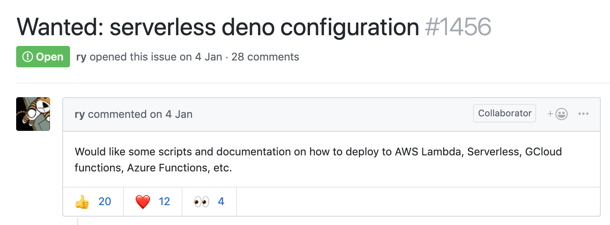
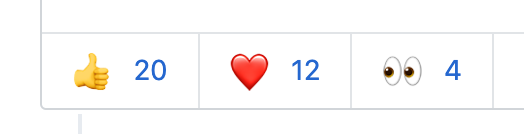
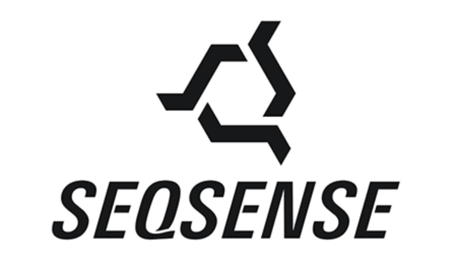
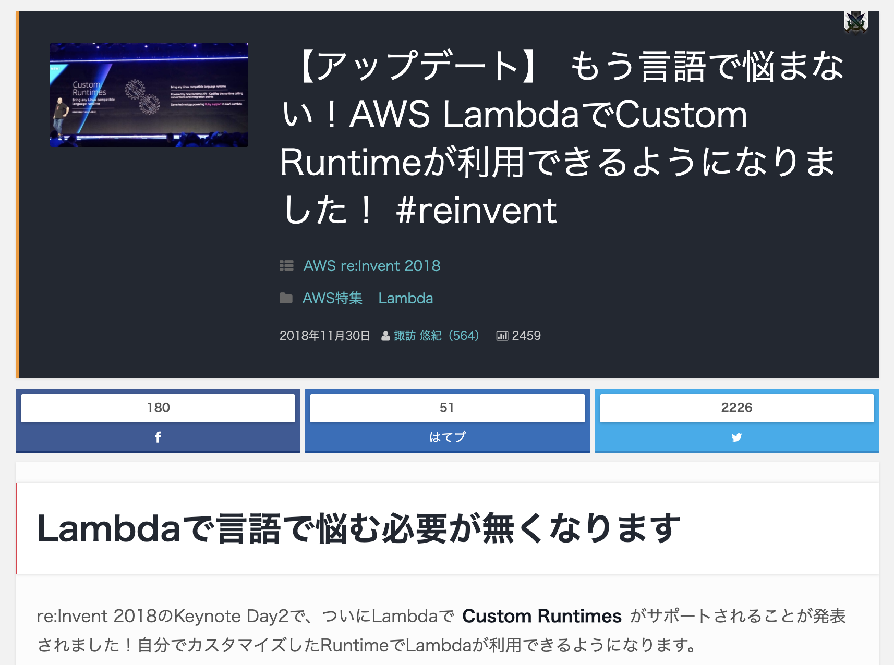
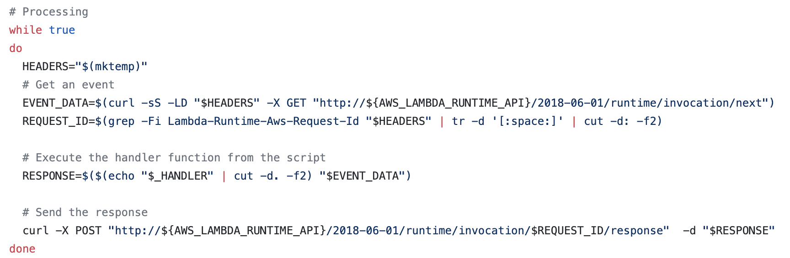
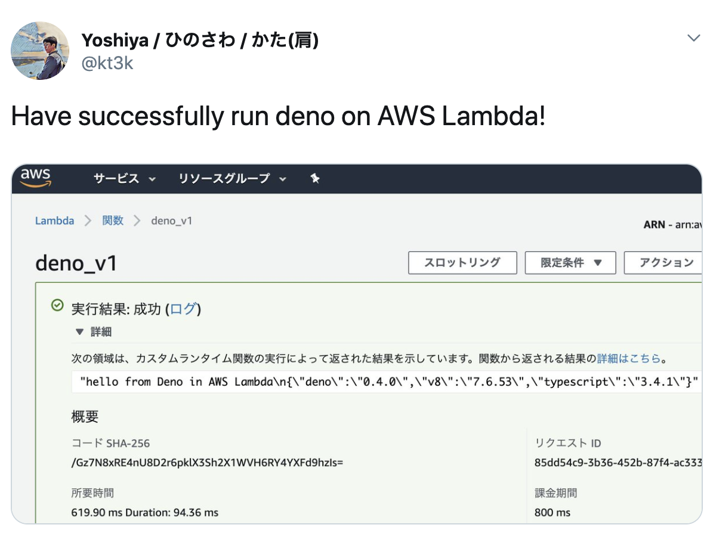
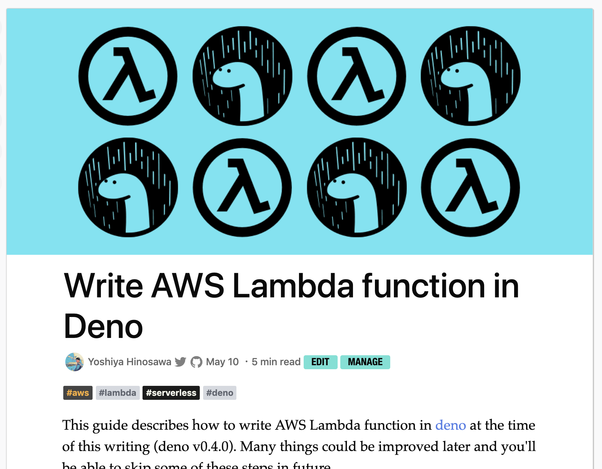
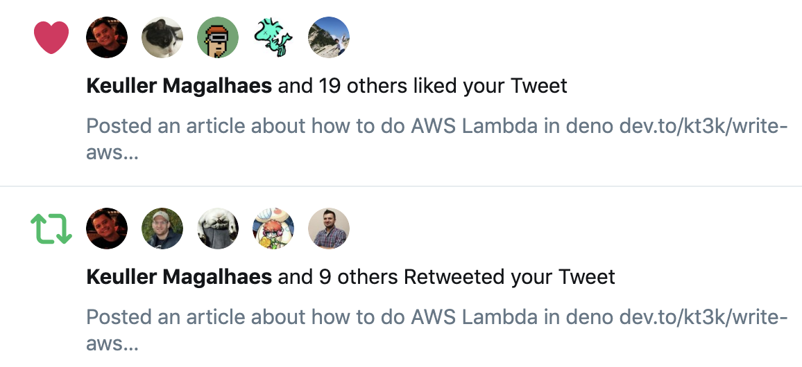
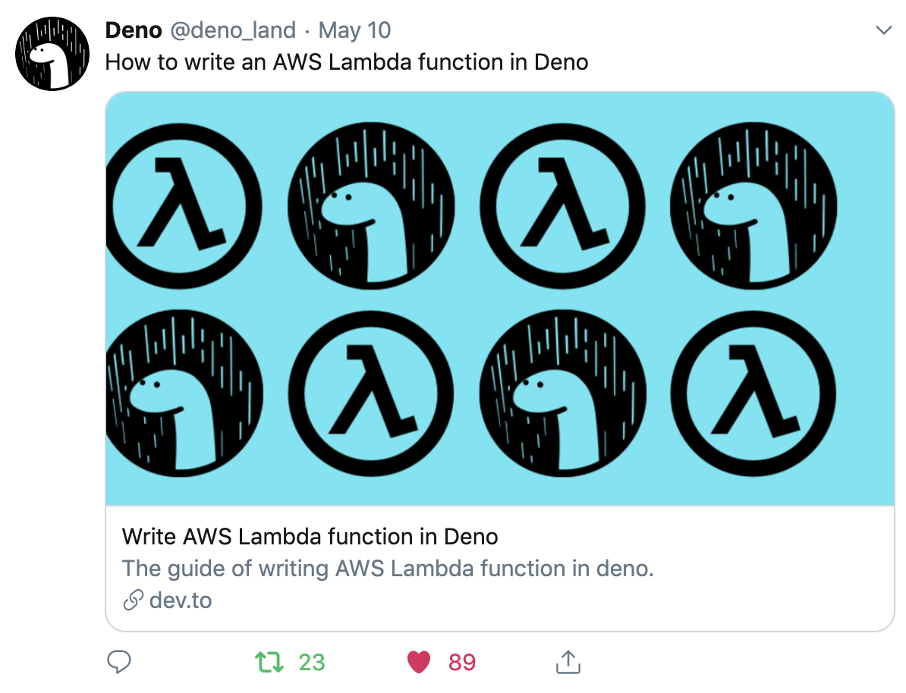

class: middle, center

# Serverless in Deno


[en](index.en.html) | [ja](index.html)

---
# [Issue 1456](https://github.com/denoland/deno/issues/1456)



---
class: middle, center
Everyone wants

---
class: middle, center
An Old Issue


... Still Open
---
class: middle, center
🤔

Is it possible to do Serverless in Deno?
---
Who I am - @kt3k


Yoshiya Hinosawa

- A Freelance Frontend Engineer (Writes React daily)
- Works in  & 

---
class: middle, center

---
class: middle, center
💡

You can write Lambda in any language now.
---
class: middle, center
Did [the tutorial](https://docs.aws.amazon.com/lambda/latest/dg/runtimes-walkthrough.html)
---
class: middle, center


[The example script](https://gist.github.com/kt3k/17e29c36bd8743289afdf21049906ff4) is very technical as bash script

Who've ever parsed http headers in bash?
---
class: middle
It roughly does:
- Initializes the lambda function
- GET request from `/runtime/invocation/next`
- POST back response to `/runtime/invocation/:request_id/response`
---
class: middle, center
Try it in Deno
---
```code
export DENO_DIR=/tmp/deno_dir
echo "
import { $HANDLER_NAME } from '$LAMBDA_TASK_ROOT/$HANDLER_FILE.ts';
const API_ROOT =
  'http://${AWS_LAMBDA_RUNTIME_API}/2018-06-01/runtime/invocation/';
(async () => {
  while (true) {
    const next = await fetch(API_ROOT + 'next');
    const reqId = next.headers.get('Lambda-Runtime-Aws-Request-Id');
    const res = await $HANDLER_NAME(await next.json());
    await (await fetch(
      API_ROOT + reqId + '/response',
      {
        method: 'POST',
        body: JSON.stringify(res)
      }
    )).blob();
  }
})();
" > /tmp/runtime.ts
$SCRIPT_DIR/deno run --allow-net --allow-read /tmp/runtime.ts
```
[link](https://github.com/kt3k/lambda-deno-runtime-wip/blob/master/bootstrap)
---
class: middle, center
Deployed it, and it worked! 💪


---
Major pitfalls:
- Needed to build custom deno
  - to avoid [GLIBC 2.18 problem](https://github.com/denoland/deno/issues/1658)
- Needed to set DENO_DIR to somewhere under /tmp/
  - because Lambda only allows to write under /tmp/
---
People asking for some article...


---
class: middle, center
[Done!](https://dev.to/kt3k/write-aws-lambda-function-in-deno-4b20)

---
class: middle, center
Many positive reactions! 😄


---
class: middle, center

Deno officially tweeted my post 😺

---
Remaining issues:
- Need to resolve GLIBC 2.18 problem
- Set up CI for Lambda Runtime
  - It seems possible by using AWS SAM
- Support Cloud Function
- Support Azure Function
- Probably we can create Now 2 deno-builder
---
class: middle, center

Let's go Deno x Serverless! 💪
---
class: middle, center

Fin 🦕
